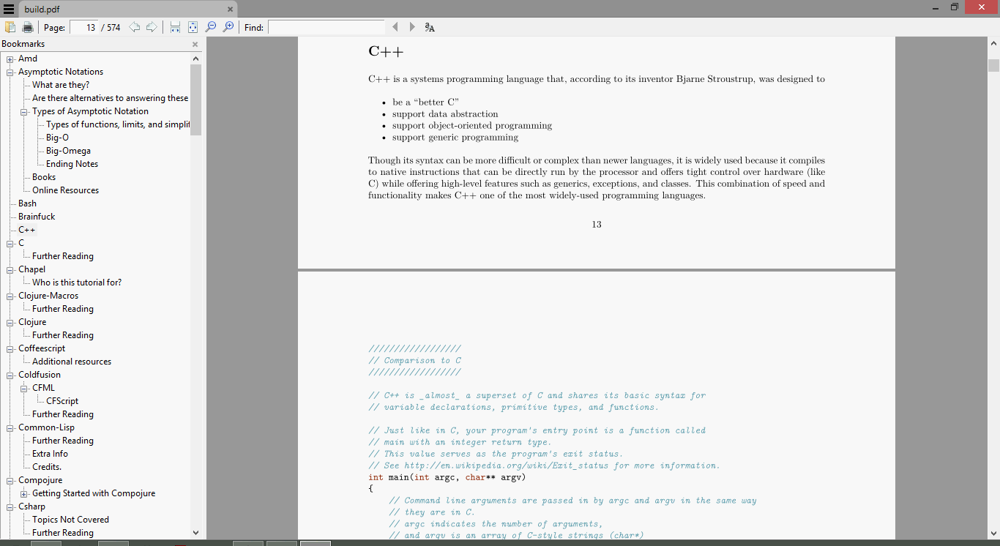

# Learn X in Y minutes - PDF

[Learn X in Y minutes](http://learnxinyminutes.com) as PDF. Source = https://github.com/adambard/learnxinyminutes-docs

Last Updated - 25/01/16

## Preview

## Download

* Downloads are hosted on [GitHub Releases](https://github.com/aviaryan/learnxinyminutes-pdf/releases/tag/v1.1.0)
* [learnxinyminutes.pdf](https://github.com/aviaryan/learnxinyminutes-pdf/releases/download/v1.1.0/learnxinyminutes.pdf) is the all-in-one PDF.
* The individual PDF files can be found as [release attachments](https://github.com/aviaryan/learnxinyminutes-pdf/releases/tag/v1.1.0).
* If you want a zip of all individual PDF's, then download [learnxinyminutes_all.zip](https://github.com/aviaryan/learnxinyminutes-pdf/releases/download/v1.1.0/learnxinyminutes_all.zip).

### Limitations

* `learnxinyminutes.pdf` doesn't include 2 languages; latex and markdown. This is because they caused conflicts while building the pdf (you can guess why). If needed, you can always download their individual pdf's from the [release attachments](https://github.com/aviaryan/learnxinyminutes-pdf/releases/latest).
 

### Building

* `genpdf.py` generates the all-in-one pdf . It is written in Python 3.
* `_genpdf.sh` generates individual pdfs. Note that this takes the generated files from Python script (in _temp directory) as the input.
* Requires `pandoc` and `latex` installed.